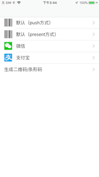
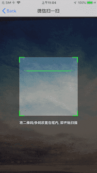
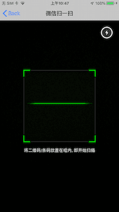
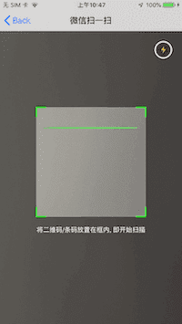
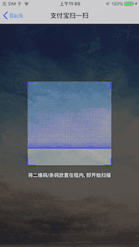
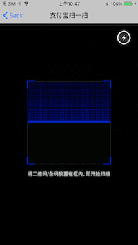
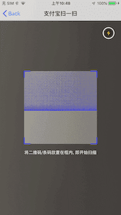
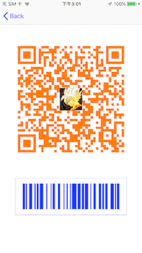

[](https://github.com/Carthage/Carthage)


# SwiftScan

## 主要内容的介绍

* `生成二维码/条形码`<br>

* `扫描二维码/条形码`<br>

* `根据光线强弱开启手电筒`<br>

* `扫描成功之后界面之间逻辑跳转处理`<br>

* `扫描界面可自定义（线扫描条样式以及网格样式）`<br>

* `扫描界面仿微信、支付宝（请根据项目需求，自行布局或调整）`<br>

- [Requirements](#requirements)
- [Installation](#installation)
- [Usage](#usage)


## Requirements

- Swift 4.2
- iOS 9.0.0+
- Xcode 9.x

<br>

## Installation

### Carthage

[Carthage](https://github.com/Carthage/Carthage) is a decentralized dependency manager that builds your dependencies and provides you with binary frameworks.

To integrate **SwiftScan** into your Xcode project using Carthage, specify it in your `Cartfile`:

```ogdl
github "chenjie1219/SwiftScan"
```

Run `carthage update` to build the framework and drag the built `SwiftScanner.framework` into your Xcode project.

### Manually

Just download the project, and drag and drop the "SwiftScanner" folder in your project.

<br>

## Usage

#### 1、在 info.plist 中添加以下字段（iOS 10 之后需添加的字段）

* `NSCameraUsageDescription (相机权限访问)`<br>

#### 2、二维码扫描

##### Push方式弹出扫描页面

```Swift
/// 创建二维码扫描
let vc = ScannerVC() 

//设置标题、颜色、扫描样式（线条、网格）、提示文字
vc.setupScanner("微信扫一扫", .green, .default, "将二维码/条码放入框内，即可自动扫描") { (code) in
//扫描回调方法
<#code#>

//关闭扫描页面
self.navigationController?.popViewController(animated: true)
}

//push到扫描页面
navigationController?.pushViewController(vc, animated: true)
```
##### Present方式弹出扫描页面

```Swift
/// 创建二维码扫描
let vc = ScannerVC() 

//设置标题、颜色、扫描样式（线条、网格）、提示文字
vc.setupScanner("支付宝扫一扫", .blue, .grid, "放入框内，自动扫描") { (code) in
//扫描回调方法
<#code#>

//关闭扫描页面
self.dismiss(animated: true, completion: nil)
}

//Present到扫描页面
present(vc, animated: true, completion: nil)
```

#### 3、二维码生成

```Swift
/// 带 logo 的二维码（logoImage为nil则不带logo）
QRCodeView.image = UIImage.generateQRCode("https://github.com/chenjie1219", 300, logoImage, .orange)
```

#### 4、条形码生成

```Swift
/// 条形码
barCodeView.image = UIImage.generateCode128("https://github.com/chenjie1219", CGSize(width: 300, height: 100, .blue)
```


## 效果图










## Author

* Email:4234115@qq.com

* Wechat:4234115